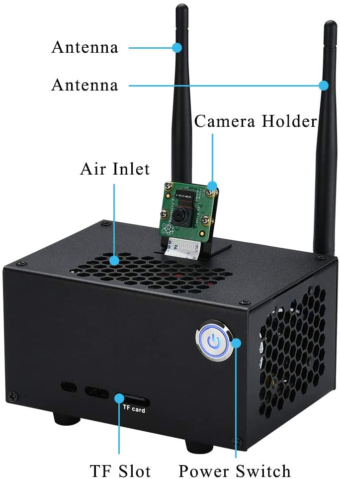

# Handgun-Detection-Deepstream

>Based on current situation around the world, there is major need of automated visual surveillance for security to detect handgun .Every now and then ,there is a gunpoint store robbery , any hostage situation or a shootout .Applying this application in our surveillance system, we can attempt to save human life and accomplish reduction in the crime rate .


To automatically detect weapon from the RTSP inputs of security camera available in the premise of Stores,Banks,Home etc. 
## Citations

* [AlexeyAB/darknet](https://github.com/AlexeyAB/darknet)
* [aj-ames/Hermes-Deepstream](https://github.com/aj-ames/Hermes-Deepstream)

## Introduction

Handgun detection Application consists of an Intelligent Video Analytics Pipeline powered by Deepstream and NVIDIA Jetson Xavier NX / NVIDIA Jetson Nano 2GB (I personally used Jetson Nano for this project but the same setup can be replicated for Jetson Xavier NX for High FPS)


This project is a proof-of-concept, trying to monitor the safety of people in any possible armed robbery , terror situations using Computer Vision and and is accelerated using NVIDIA Deepstream and can be done with a surveillance camera or raspberry pi v2 (CSI) and an onboard Jetson platform.


###### Camera (CSI) was tested as an alternative to lower quality CCTV cameras as those can omit False Positives and False Negatives due to the low image resolution.   



## Deepstream Setup

This post assumes you have a fully functional Jetson device. If not, you can refer the documentation [here](https://docs.nvidia.com/jetson/jetpack/install-jetpack/index.html).

### 1. Install System Dependencies

```sh
sudo apt install \
libssl1.0.0 \
libgstreamer1.0-0 \
gstreamer1.0-tools \
gstreamer1.0-plugins-good \
gstreamer1.0-plugins-bad \
gstreamer1.0-plugins-ugly \
gstreamer1.0-libav \
libgstrtspserver-1.0-0 \
libjansson4=2.11-1
```
### 2. Install Deepstream

Download the DeepStream 5.0.1 Jetson Debian package `deepstream-5.1_5.1.0-1_arm64.deb`, to the Jetson device. Then enter the command:

```sh
sudo apt-get install ./deepstream-5.1_5.1.0-1_arm64.deb

cd  /opt/nvidia/deepstream/deepstream-5.1/sources
```
## Running the Application

### 1. Clone the repository

This is a straightforward step, however, if you are new to git or git-lfs, I recommend glancing through the steps.

First, install git and git-lfs

```sh
sudo apt install git git-lfs
```

Next, clone the repository

```sh
# Using HTTPS
git clone https://github.com/Abhishek97M/Handgun-Detection-Deepstream.git

#Using SSh
git@github.com:Abhishek97M/Handgun-Detection-Deepstream.git
```

## 2. Trained Weights
## YoloV3 Weights: [here](https://drive.google.com/file/d/1aFEyuW_sSD25Yz2s1Tmsb18KXRuQxWAx/view?usp=sharing)
Download the Yolov3 weights file from the above link and move to this folder

## 3. Compile

```
CUDA_VER=10.2 make -C nvdsinfer_custom_impl_Yolo
```
This is a one-time step and you need to do this only when you make source-code changes.

### Understanding and editing deepstream_app_config
To understand and edit deepstream_app_config.txt file, read the [DeepStream SDK Development Guide - Configuration Groups](https://docs.nvidia.com/metropolis/deepstream/dev-guide/text/DS_ref_app_deepstream.html#configuration-groups)

##
* Edit source

Example for 1 source:
```
[source0]
enable=1
# 1=Camera (V4L2), 2=URI, 3=MultiURI, 4=RTSP, 5=Camera (CSI; Jetson only)
type=3
# Stream URL
uri=file:///home/user/Videos/input.mp4 or <rtsp url>
# Number of sources copy (if > 1, you need edit rows/columns in tiled-display section and batch-size in streammux section and config_infer_primary.txt; need type=3 for more than 1 source)
num-sources=1
gpu-id=0
cudadec-memtype=0
```

Example for 2 sources:
```
[source0]
enable=1
type=3
uri=file:///home/user/Videos/input.mp4 or <rtsp url>
num-sources=1
gpu-id=0
cudadec-memtype=0

[source1]
enable=1
type=3
uri=file:///home/user/Videos/input.mp4 or <rtsp url>
num-sources=1
gpu-id=0
cudadec-memtype=0

```
Example for Camera (CSI):
```
[source0]
enable = 1
type = 5
intra-decode-enable = 1
gpu-id = 0
camera-id = 0
camera-width = 960
camera-height = 616
camera-fps-n = 21
camera-fps-d = 1
camera-csi-sensor-id = 0
drop-frame-interval = 0
cudadec-memtype=0

```

Now, run the application for file/rtsp source by running the following command:

```sh
deepstream-app -c deepstream-gun-yoloV3.txt
```

Or you can run the same with tiny-yolov3 for faster inference:

```sh
deepstream-app -c deepstream-gun-yoloV3-tiny.txt
```

To run the application for Camera (CSI) by running the following command:

```sh
deepstream-app -c deepstream-guncsi-yoloV3.txt
```


## Video demonstration of the App

Link to video demonstartion [video_link](https://youtu.be/bBGRToLKFEQ)

## References
- Dataset 1 - https://www.kaggle.com/abhishek4273/gun-detection-dataset
- Dataset 2 (Open Images) - https://github.com/EscVM/OIDv4_ToolKit
- Darknet repository (training only) - https://github.com/AlexeyAB/darknet
